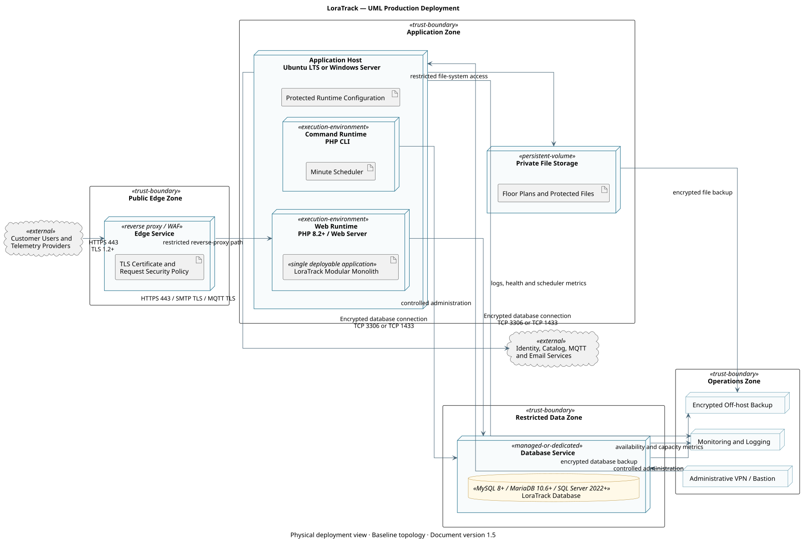

<section class="cover">
<h1>LoraTrack</h1>
<h2>Production Infrastructure and Operations Guide</h2>
<p><strong>Document version:</strong> 1.5</p>
<p><strong>Classification:</strong> Public product documentation</p>
</section>

<div class="page-break"></div>

# Document Control

| Field | Value |
| --- | --- |
| Product | LoraTrack |
| Document type | Production Infrastructure and Operations Guide |
| Document version | 1.5 |
| Audience | Users, administrators, engineering, operations, and security teams |

> This documentation describes product capabilities and procedures. References to practices or standards do not constitute certification, independent assurance, or formal customer acceptance.

# Document Index

- [Production Deployment Architecture](#docs-architecture-production-deployment-md)
- [Production Infrastructure Requirements](#docs-operations-dependency-matrix-md)
- [Production Deployment and Configuration](#docs-operations-deployment-and-environments-md)
- [Ubuntu LTS Deployment Tutorial](#docs-operations-deployment-ubuntu-lts-md)
- [Windows Server and IIS Deployment Tutorial](#docs-operations-deployment-windows-iis-md)
- [Operations, Monitoring, and Runbooks](#docs-operations-operations-runbook-md)
- [Field Commissioning Guide](#docs-operations-field-commissioning-md)

<div class="page-break"></div>

<a id="docs-architecture-production-deployment-md"></a>

# Production Deployment Architecture

## Purpose

This UML deployment diagram defines the production infrastructure boundary, deployed application nodes, required services, trust zones, and principal communication paths. The final topology may use customer-managed servers or equivalent managed services while preserving the same security boundaries.

The application host runs one LoraTrack modular-monolith deployment. The web runtime and minute scheduler are two execution entry points into the same application release, configuration, domain modules, and database; they are not separate application services.



## Production Nodes

| Node | Required Responsibility |
| --- | --- |
| Edge security | Terminates trusted HTTPS, applies request limits, and optionally provides WAF or reverse-proxy controls. |
| Application host | Runs the web application and the minute scheduler with access to protected configuration and private storage. |
| Database service | Provides MySQL 8+, MariaDB 10.6+, or Microsoft SQL Server 2022+ persistence over encrypted transport and accepts connections only from approved application hosts. |
| Private storage | Retains customer floor plans and protected application files outside the public web root. |
| Monitoring service | Receives availability, application, scheduler, capacity, and security signals. |
| Backup repository | Stores encrypted, access-controlled database and private-file backups outside the application host. |

## Trust and Network Boundaries

- Only HTTPS is exposed to users and inbound webhook providers.
- The database is placed in a restricted data zone and is not publicly accessible.
- Administrative access uses the customer's approved VPN, bastion, or management network.
- Outbound traffic is restricted to configured identity, catalog, telemetry, email, DNS, NTP, monitoring, and backup destinations.
- Database and backup traffic must be encrypted in transit; backup copies must also be encrypted at rest. The selected database driver and trust configuration must match MySQL/MariaDB or SQL Server.
- Production secrets remain outside the public document root and are readable only by the application service account and authorized administrators.

The editable UML source is provided in [`production-deployment-diagram.puml`](architecture/diagrams/production-deployment-diagram.puml).

## Engineering Assumptions

- The baseline shows one logical application host; approved high-availability deployments may use multiple equivalent hosts with shared state and verified scheduler locking.
- The database and backup services may be managed services or dedicated customer infrastructure provided the documented trust boundaries and transport controls are preserved.
- Firewall rules must be derived from enabled connectors; optional SMTP and MQTT paths are not opened when those capabilities are disabled.
- Monitoring and backup paths are mandatory production responsibilities even when implemented by customer-standard platforms not named in the diagram.

<div class="page-break"></div>

<a id="docs-operations-dependency-matrix-md"></a>

# Production Infrastructure Requirements

This section defines the infrastructure a customer must provide to operate LoraTrack in production. Final capacity must be confirmed from the expected number of organizations, assets, users, connectors, telemetry volume, retention period, and availability target.

## Application Runtime

| Component | Production Requirement | Operational Notes |
| --- | --- | --- |
| Operating system | Supported Ubuntu LTS or Windows Server with IIS 10 | Apply vendor security updates under the customer's patch policy. |
| PHP | 8.2 or later, supported by the selected operating system | Enable OPcache and configure memory and request limits for the expected workload. |
| Web server | Nginx or Apache on Linux; IIS 10 on Windows | Publish only the Laravel `public` directory and enforce HTTPS. |
| Database | MySQL 8.0+, MariaDB 10.6+, or Microsoft SQL Server 2022+ | Use a dedicated database and least-privilege application account. Require encrypted transport and the matching PHP PDO driver. |
| Scheduler | Cron or Windows Task Scheduler | Execute `php artisan schedule:run` once per minute. A persistent Laravel Queue worker is not required. |
| Storage | Persistent application storage plus independent backup capacity | Private floor plans, generated data, and application logs must not be exposed by the web server. |
| DNS and TLS | Customer-controlled production hostname and valid trusted certificate | Monitor certificate expiration and redirect HTTP to HTTPS. |
| Time synchronization | NTP-synchronized application and database hosts | Required for reliable telemetry, audit, and troubleshooting timestamps. |

## Required PHP Extensions

Enable `bcmath`, `ctype`, `curl`, `dom`, `fileinfo`, `gd`, `json`, `mbstring`, `openssl`, `pdo`, `tokenizer`, `xml`, `xmlreader`, `xmlwriter`, and `zip`. Enable `pdo_mysql` for MySQL/MariaDB or Microsoft `pdo_sqlsrv` for SQL Server. `intl` is recommended. Redis support is optional when Redis is selected for cache or sessions.

## Database Transport and Capacity

- Require encrypted transport between the application and database and install the required trust chain on the application host.
- For MySQL/MariaDB, configure `MYSQL_ATTR_SSL_CA` with the absolute CA certificate path.
- When the PHP MySQL driver uses `libmysql`, configure `MYSQL_ATTR_MAX_BUFFER_SIZE=6291456` so accepted Meraki payloads are not truncated during database reads.
- For SQL Server, install Microsoft ODBC Driver 18 and `pdo_sqlsrv`, enable certificate validation, and use TCP 1433 or the customer-approved explicit port.
- Allocate database memory, connections, storage, and IOPS from measured production volume rather than generic minimums.
- Monitor table growth, slow queries, connection utilization, storage consumption, and backup duration.

## Network Connectivity

The customer firewall and proxy policy must permit only the flows required by enabled capabilities:

| Flow | Direction | Purpose |
| --- | --- | --- |
| HTTPS 443 | Inbound | User access and authenticated webhook delivery. |
| Database TLS | Application to database | TCP 3306 for MySQL/MariaDB or TCP 1433 for SQL Server by default; restrict by source and destination. |
| HTTPS 443 | Outbound | Microsoft identity and configured catalog or telemetry providers. |
| SMTP submission | Outbound | Notifications and invitations when email is enabled. |
| MQTT TLS | Outbound | Required only for configured MQTT connectors. |
| DNS and NTP | Outbound | Name resolution and time synchronization. |

The database must not be exposed to the public internet. Administrative access should use the customer's controlled management network, VPN, or bastion service.

## External Services by Enabled Capability

| Service | When Required |
| --- | --- |
| Microsoft Entra ID | Microsoft sign-in. |
| SMTP service | Invitations, password workflows, and operational notifications. |
| The Things Industries | TTI webhook or MQTT telemetry. |
| Meraki | Meraki Scanning/Location API ingestion. |
| SAP S/4HANA or another catalog provider | Automated catalog synchronization. |
| Central logging and monitoring platform | Production alerting, audit support, and incident investigation. |
| Backup repository | Encrypted database and private-file backups stored outside the application host. |

## Capacity Inputs Required Before Sizing

The customer and implementation team must agree on:

- expected concurrent and named users;
- organizations, sites, buildings, floors, assets, and devices;
- number and type of connectors;
- average and peak webhook or MQTT events per minute;
- maximum accepted payload size;
- observation, audit, and location-history retention periods;
- floor-plan file volume;
- required availability, RPO, and RTO;
- backup retention and restoration-test frequency.

Do not approve production capacity until representative telemetry and user workloads have been validated in a customer-approved pre-production environment.

<div class="page-break"></div>

<a id="docs-operations-deployment-and-environments-md"></a>

# Production Deployment and Configuration

## Base Requirements

- PHP 8.2 or higher.
- Composer.
- MySQL 8.0+, MariaDB 10.6+, or Microsoft SQL Server 2022+ with encrypted transport.
- PHP extensions required by Laravel and the selected database.
- Cron or Windows Task Scheduler for the minute scheduler invocation.
- TLS on the public domain.

## Environment Variables

Start from `.env.example`. Do not generate `.env` from a pipeline containing embedded secrets.

Critical variables:

- `APP_ENV`
- `APP_KEY`
- `APP_DEBUG=false` in production
- `APP_URL`
- `DB_*`
- `MYSQL_ATTR_SSL_CA` for MySQL/MariaDB deployments that require TLS.
- `MYSQL_ATTR_MAX_BUFFER_SIZE=6291456` when PDO uses `libmysql`, so Meraki payloads up to the 5 MiB HTTP limit are not truncated while being read.
- SQL Server encryption and certificate-trust parameters when `DB_CONNECTION=sqlsrv` is selected.
- `CACHE_STORE`
- `SESSION_DRIVER`
- `MAIL_*`
- `MICROSOFT_*` when Microsoft Entra ID is used

## Initial Installation

```bash
composer install --no-dev --optimize-autoloader
php artisan key:generate
php artisan migrate --force
php artisan config:cache
php artisan route:cache
php artisan view:cache
```

Do not regenerate `APP_KEY` in an existing production environment because it invalidates encrypted data and sessions.

## File Permissions

Laravel requires write access to:

- `storage/`
- `bootstrap/cache/`

Floor plans must remain in private storage:

```text
storage/app/private
```

Do not expose floor plans through a public symlink.

## Scheduler

Run `php artisan schedule:run` once every minute. The scheduler drains durable webhook inboxes and processes observations, TTI/MQTT events, catalog synchronization requests, alerts, and retention activities. A persistent Laravel Queue worker is not required. Configure exactly one effective scheduler invocation per environment unless a tested distributed locking design has been approved.

The production scheduler account requires access to the application directory, PHP CLI, application configuration, logs, private storage, and the production database. Monitor invocation failures and total processing duration.

## Customer Validation Environment

| Environment | Purpose | Data |
| --- | --- | --- |
| pre-production | deployment, integration, capacity, recovery, and customer acceptance validation | synthetic, anonymized, or explicitly approved data |
| production | live operation | controlled data |

Do not use real payloads or real floor plans in non-production without approval and controls.

## Backup and Restore

The plan must cover:

- database;
- `storage/app/private`;
- production `.env`;
- logs required by audit;
- deployed release version.

Initial frequency recommendation:

- daily full backup;
- retention based on contract;
- restore test quarterly or before critical releases.

## Minimum Monitoring

- HTTP availability;
- 5xx errors;
- failed scheduled commands;
- pending webhook and connector backlog;
- database growth;
- disk space;
- inactive connectors;
- telemetry pending beyond threshold;
- TLS certificates;
- token and credential expiration.

## Rollback

Define before each change:

- previous release version;
- migration compatibility;
- pre-deploy backup;
- scheduler suspension and controlled resumption procedure;
- failed-event replay procedure;
- user communication plan.

## Production Hardening

- `APP_DEBUG=false`.
- Mandatory TLS.
- Database not publicly exposed.
- Least-privilege database users.
- Encrypted backups.
- Secret rotation.
- WAF or reverse proxy when applicable.
- Request size limits.
- Centralized logs.
- Disable test accounts.

<div class="page-break"></div>

<a id="docs-operations-deployment-ubuntu-lts-md"></a>

# Ubuntu LTS Deployment Tutorial

## Scope

Tutorial for deploying LoraTrack on Ubuntu Server LTS with Nginx, PHP-FPM, MySQL or MariaDB, and cron.

Production baseline:

- PHP 8.2 or later.
- MySQL 8.0 or later, or MariaDB 10.6 or later.
- TLS for public access and database transport.

## 1. Prepare the Server

```bash
sudo apt update
sudo apt upgrade -y
sudo apt install -y software-properties-common unzip git curl ca-certificates gnupg
```

## 2. Install PHP and Extensions

```bash
sudo apt install -y php php-fpm php-cli php-common php-mbstring php-xml php-curl php-zip php-bcmath php-gd php-intl php-opcache php-mysql
```

Verify:

```bash
php -v
php -m | grep -E "bcmath|curl|fileinfo|gd|mbstring|openssl|xml|zip"
```

Suggested `php.ini` values:

```ini
memory_limit=256M
upload_max_filesize=25M
post_max_size=30M
max_execution_time=120
date.timezone=America/Santiago
opcache.enable=1
opcache.enable_cli=1
```

Restart FPM:

```bash
sudo systemctl restart php*-fpm
```

## 3. Install Nginx

```bash
sudo apt install -y nginx
sudo systemctl enable nginx
sudo systemctl start nginx
```

## 4. Configure MySQL or MariaDB Connectivity

Provision a supported MySQL or MariaDB service with encrypted transport. Install the customer-approved CA certificate on the application server and restrict database access to the application host.

Validate:

```bash
php -m | grep -E "mysqli|pdo_mysql"
sudo systemctl restart php*-fpm
```

Database account example:

```sql
CREATE DATABASE loratrack CHARACTER SET utf8mb4 COLLATE utf8mb4_unicode_ci;
CREATE USER 'loratrack_app'@'APPLICATION_HOST' IDENTIFIED BY 'CHANGE_ME_LONG_SECRET';
GRANT SELECT, INSERT, UPDATE, DELETE, CREATE, ALTER, INDEX, DROP, REFERENCES
    ON loratrack.* TO 'loratrack_app'@'APPLICATION_HOST';
FLUSH PRIVILEGES;
```

After migrations, evaluate removing DDL permissions from the runtime account and using a separate migration account.

## 5. Install Composer

```bash
cd /tmp
php -r "copy('https://getcomposer.org/installer', 'composer-setup.php');"
php composer-setup.php
sudo mv composer.phar /usr/local/bin/composer
composer --version
```

Validate the official checksum before running the installer in controlled environments.

## 6. Application Directory

```bash
sudo adduser --system --group --home /var/www/loratrack loratrack
sudo mkdir -p /var/www/loratrack/current
sudo chown -R loratrack:www-data /var/www/loratrack
sudo -u loratrack git clone REPO_URL /var/www/loratrack/current
cd /var/www/loratrack/current
```

Install dependencies:

```bash
sudo -u loratrack composer install --no-dev --optimize-autoloader
```

## 7. Configure `.env`

```bash
sudo -u loratrack cp .env.example .env
sudo -u loratrack nano .env
```

Minimum values:

```dotenv
APP_NAME=LoraTrack
APP_ENV=production
APP_DEBUG=false
APP_URL=https://loratrack.example.com
APP_TIMEZONE=America/Santiago

DB_CONNECTION=mysql
DB_HOST=mysql.example.com
DB_PORT=3306
DB_DATABASE=loratrack
DB_USERNAME=loratrack_app
DB_PASSWORD=CHANGE_ME_LONG_SECRET

MYSQL_ATTR_SSL_CA=/etc/ssl/certs/customer-mysql-ca.pem
MYSQL_ATTR_MAX_BUFFER_SIZE=6291456
CACHE_STORE=database
SESSION_DRIVER=database
```

Generate `APP_KEY` only for a new installation:

```bash
sudo -u loratrack php artisan key:generate
```

## 8. Permissions, Migrations, and Cache

```bash
sudo chown -R loratrack:www-data /var/www/loratrack/current
sudo find /var/www/loratrack/current -type f -exec chmod 0644 {} \;
sudo find /var/www/loratrack/current -type d -exec chmod 0755 {} \;
sudo chmod -R ug+rwx /var/www/loratrack/current/storage /var/www/loratrack/current/bootstrap/cache

sudo -u loratrack php artisan migrate --force
sudo -u loratrack php artisan config:cache
sudo -u loratrack php artisan route:cache
sudo -u loratrack php artisan view:cache
```

## 9. Nginx Site

Use `/var/www/loratrack/current/public` as the web root.

```nginx
server {
    listen 80;
    server_name loratrack.example.com;
    root /var/www/loratrack/current/public;
    index index.php index.html;
    client_max_body_size 30M;

    location / {
        try_files $uri $uri/ /index.php?$query_string;
    }

    location ~ \.php$ {
        include snippets/fastcgi-php.conf;
        fastcgi_pass unix:/run/php/php-fpm.sock;
        fastcgi_param SCRIPT_FILENAME $realpath_root$fastcgi_script_name;
        include fastcgi_params;
    }

    location ~ /\.(?!well-known).* {
        deny all;
    }
}
```

Adjust the PHP-FPM socket to the installed version.

## 10. TLS

Use an approved PKI certificate or Let's Encrypt where allowed.

## 11. Scheduler

Scheduler cron:

```cron
* * * * * cd /var/www/loratrack/current && php artisan schedule:run >> storage/logs/schedule.log 2>&1
```

No Laravel Queue systemd service is required.

## 12. Optional Microsoft Login

```dotenv
MICROSOFT_CLIENT_ID=
MICROSOFT_CLIENT_SECRET=
MICROSOFT_TENANT_ID=
MICROSOFT_REDIRECT_URI=https://loratrack.example.com/auth/microsoft/callback
```

Then run:

```bash
sudo -u loratrack php artisan config:cache
```

## 13. Post-Deployment Verification

```bash
curl -I https://loratrack.example.com/login
sudo -u loratrack php artisan about
sudo -u loratrack php artisan schedule:run
```

Validate login, dashboard, `/operations/health`, connector creation, TTI ingestion, private floor plan access, and scheduled processing.

<div class="page-break"></div>

<a id="docs-operations-deployment-windows-iis-md"></a>

# Windows Server and IIS Deployment Tutorial

## Scope

Tutorial for deploying LoraTrack on Windows Server with IIS, PHP FastCGI, MySQL or MariaDB, and Task Scheduler.

Production baseline:

- PHP 8.2 or later.
- MySQL 8.0 or later, or MariaDB 10.6 or later.
- TLS for public access and database transport.

## 1. Required Components

Install:

- Windows Server 2019/2022/2025.
- IIS 10.
- PHP 8.2+ Non Thread Safe x64.
- Visual C++ Redistributable required by PHP.
- Composer 2.x for Windows.
- Customer-managed MySQL 8.0+ or MariaDB 10.6+ service.
- Trusted CA certificate for database TLS.
- IIS URL Rewrite Module.
- An approved mechanism for transferring the authorized application release.

## 2. Enable IIS and CGI

PowerShell as Administrator:

```powershell
Install-WindowsFeature Web-Server, Web-CGI, Web-Common-Http, Web-Default-Doc, Web-Static-Content, Web-Http-Errors, Web-Http-Redirect, Web-Filtering, Web-Mgmt-Console
```

Install URL Rewrite from an approved internal package or Microsoft source.

## 3. Install PHP

Install PHP NTS x64, for example:

```text
C:\PHP\8.3
```

Copy `php.ini-production` to `php.ini` and enable:

```ini
extension_dir="ext"
extension=bcmath
extension=curl
extension=fileinfo
extension=gd
extension=mbstring
extension=openssl
extension=pdo_mysql
extension=zip

cgi.force_redirect=0
cgi.fix_pathinfo=1
fastcgi.impersonate=1

memory_limit=256M
upload_max_filesize=25M
post_max_size=30M
max_execution_time=120
date.timezone=America/Santiago
opcache.enable=1
opcache.enable_cli=1
```

Verify:

```powershell
php -v
php -m
```

## 4. Configure PHP FastCGI in IIS

Add a handler mapping:

- Request path: `*.php`
- Module: `FastCgiModule`
- Executable: `C:\PHP\8.3\php-cgi.exe`
- Name: `PHP via FastCGI`

## 5. MySQL or MariaDB Setup

Provision a supported database service with TLS required. Restrict network access to the application server and use a dedicated least-privilege account.

Create database and login:

```sql
CREATE DATABASE loratrack CHARACTER SET utf8mb4 COLLATE utf8mb4_unicode_ci;
CREATE USER 'loratrack_app'@'APPLICATION_HOST' IDENTIFIED BY 'CHANGE_ME_LONG_SECRET';
GRANT SELECT, INSERT, UPDATE, DELETE, CREATE, ALTER, INDEX, DROP, REFERENCES
    ON loratrack.* TO 'loratrack_app'@'APPLICATION_HOST';
FLUSH PRIVILEGES;
```

Validate:

```sql
select @@version;
```

## 6. Application Directory

```powershell
New-Item -ItemType Directory -Force C:\inetpub\loratrack
git clone REPO_URL C:\inetpub\loratrack
cd C:\inetpub\loratrack
composer install --no-dev --optimize-autoloader
```

## 7. Configure `.env`

```powershell
Copy-Item .env.example .env
notepad .env
```

Minimum values:

```dotenv
APP_NAME=LoraTrack
APP_ENV=production
APP_DEBUG=false
APP_URL=https://loratrack.example.com
APP_TIMEZONE=America/Santiago

DB_CONNECTION=mysql
DB_HOST=mysql.example.com
DB_PORT=3306
DB_DATABASE=loratrack
DB_USERNAME=loratrack_app
DB_PASSWORD=CHANGE_ME_LONG_SECRET

MYSQL_ATTR_SSL_CA=C:\ProgramData\LoraTrack\certificates\mysql-ca.pem
MYSQL_ATTR_MAX_BUFFER_SIZE=6291456
CACHE_STORE=database
SESSION_DRIVER=database
```

Generate `APP_KEY` only for a new installation:

```powershell
php artisan key:generate
```

## 8. Configure IIS Site

The site physical path must be:

```text
C:\inetpub\loratrack\public
```

Example:

```powershell
Import-Module WebAdministration
New-Website -Name "LoraTrack" -Port 80 -HostHeader "loratrack.example.com" -PhysicalPath "C:\inetpub\loratrack\public"
```

Configure HTTPS using an approved PKI or public CA certificate.

## 9. `web.config`

Create `C:\inetpub\loratrack\public\web.config`:

```xml
<?xml version="1.0" encoding="UTF-8"?>
<configuration>
  <system.webServer>
    <rewrite>
      <rules>
        <rule name="Laravel" stopProcessing="true">
          <match url=".*" />
          <conditions logicalGrouping="MatchAll">
            <add input="{REQUEST_FILENAME}" matchType="IsFile" negate="true" />
            <add input="{REQUEST_FILENAME}" matchType="IsDirectory" negate="true" />
          </conditions>
          <action type="Rewrite" url="index.php" />
        </rule>
      </rules>
    </rewrite>
    <security>
      <requestFiltering>
        <requestLimits maxAllowedContentLength="31457280" />
      </requestFiltering>
    </security>
    <defaultDocument>
      <files>
        <clear />
        <add value="index.php" />
      </files>
    </defaultDocument>
  </system.webServer>
</configuration>
```

Do not point IIS to the project root.

## 10. NTFS Permissions

Grant read access to the project and write access only to:

- `storage`
- `bootstrap\cache`

Example:

```powershell
icacls C:\inetpub\loratrack /grant "IIS AppPool\LoraTrack:(OI)(CI)RX"
icacls C:\inetpub\loratrack\storage /grant "IIS AppPool\LoraTrack:(OI)(CI)M"
icacls C:\inetpub\loratrack\bootstrap\cache /grant "IIS AppPool\LoraTrack:(OI)(CI)M"
```

## 11. Migrate and Optimize

```powershell
php artisan migrate --force
php artisan config:cache
php artisan route:cache
php artisan view:cache
```

## 12. Task Scheduler

Scheduler task:

- Program: `C:\PHP\8.3\php.exe`
- Arguments: `artisan schedule:run`
- Start in: `C:\inetpub\loratrack`
- Repeat every minute.

No Laravel Queue task or persistent queue service is required.

## 13. Optional Microsoft Login

```dotenv
MICROSOFT_CLIENT_ID=
MICROSOFT_CLIENT_SECRET=
MICROSOFT_TENANT_ID=
MICROSOFT_REDIRECT_URI=https://loratrack.example.com/auth/microsoft/callback
```

Apply:

```powershell
php artisan config:cache
iisreset
```

## 14. Post-Deployment Verification

```powershell
Invoke-WebRequest https://loratrack.example.com/login -UseBasicParsing
php artisan about
php artisan schedule:run
```

Validate login, dashboard, `/operations/health`, floor plan access, connector creation, telemetry processing, and email delivery.

## 15. Troubleshooting

- Error 500: inspect `storage\logs\laravel.log` and Windows Event Viewer.
- Laravel routes return 404: verify URL Rewrite and `web.config`.
- Permission errors: reapply permissions on `storage` and `bootstrap\cache`.
- `.env` changes do not apply: run `php artisan config:clear`, `php artisan config:cache`, and `iisreset`.
- Telemetry does not process: run `php artisan schedule:run -v` manually and inspect Task Scheduler history.

<div class="page-break"></div>

<a id="docs-operations-operations-runbook-md"></a>

# Operations, Monitoring, and Runbooks

## Objective

Define the minimum tasks required to operate LoraTrack in an enterprise environment and diagnose common failures.

## Required Processes

### Scheduler

Run every minute:

```bash
php artisan schedule:run
```

The scheduler is the only required background executor. It processes Meraki batches and observations, TTI/MQTT telemetry, and requested catalog synchronizations without Laravel Queue. TTI and MQTT commands process at most three pending events per execution.

Scheduled tasks:

- `loratrack:evaluate-alerts` every 10 minutes.
- `loratrack:manage-telemetry-storage` hourly.
- `loratrack:prune-meraki-history` hourly.

### MQTT Listener

When MQTT connectors are configured:

```bash
php artisan loratrack:mqtt-listen
```

The listener must be supervised and restarted on failure.

## Operational Health View

Route:

```text
/operations/health
```

Review:

- stuck telemetry;
- connector errors;
- private storage state;
- anchors by floor plan;
- recent audit records.

## Logs

Laravel log:

```text
storage/logs/laravel.log
```

Scheduler cron output example:

```bash
php artisan schedule:run >> storage/logs/schedule.log 2>&1
```

Do not enable tracing that prints credentials.

## Runbook: Telemetry Stays Pending

1. Confirm scheduler execution:

```bash
php artisan schedule:run -v
```

2. Review recent events:

```sql
select id, connector_id, device_id, processing_status, processing_error,
       observed_at, received_at, processed_at
from telemetry_events
order by received_at desc
limit 20;
```

3. Check database connection limits if `max_user_connections` appears.

4. Confirm there is only one cron entry invoking the scheduler each minute.

## Runbook: TTI Arrives but Asset Time Does Not Update

1. Check recent event identity and timestamps.
2. Check event processing status.
3. Check active asset-device assignment.
4. Check that the event has signal observations.
5. Check whether a position estimate was generated.

Useful SQL:

```sql
select id, device_id, observed_at, received_at, processing_status, processing_error
from telemetry_events
order by received_at desc
limit 10;
```

## Runbook: Track View Shows Fewer Points Than Expected

The track view shows `position_estimates`, not raw `telemetry_events`.

Review:

```sql
select id, asset_id, telemetry_event_id, floor_plan_id, calculated_at, x, y
from position_estimates
where asset_id = '{asset_id}'
order by calculated_at desc;
```

If telemetry exists without a position, check:

- fewer than three valid MAC/RSSI observations;
- anchors not installed;
- inactive anchors;
- anchors on different floor plans;
- expired assignment;
- failed event;
- floor plan filter in the UI.

## Runbook: Disabled Connector

A disabled connector does not process telemetry. Queued events are marked `ignored` when taken by the job.

To resume:

1. Activate connector.
2. Send a new payload or requeue events according to policy.
3. Confirm `last_activity_at` and `last_success_at`.

## Runbook: Database Connection Limit Exhausted

Symptom:

```text
SQLSTATE[42000] [1226] User has exceeded the max_user_connections resource
```

Actions:

- remove duplicate scheduler cron entries;
- review cron overlap;
- review persistent connections;
- increase database limits if load justifies it.

## Monthly Maintenance Checklist

- review users and roles;
- review active connectors and tokens;
- test backup restoration;
- review `telemetry_events` growth;
- review failed scheduled commands and pending ingestion records;
- validate SMTP alerts;
- review recurring log errors;
- review applicable vendor security advisories and the approved dependency assessment report;
- update change documentation.

## Escalation Data

For level 2/3 support collect:

- exact timestamp;
- organization;
- connector;
- device identifier;
- telemetry event ID;
- asset ID;
- position estimate ID when present;
- sanitized log excerpt;
- deployed release version;
- recent configuration changes.

<div class="page-break"></div>

<a id="docs-operations-field-commissioning-md"></a>

# Field Commissioning Guide

## Objective

Define a baseline procedure for installing, validating, and calibrating LoraTrack in an industrial facility.

## Suggested Roles

| Role | Responsibility |
| --- | --- |
| Project lead | Scope, work windows, and acceptance. |
| OT/IT engineering | Network, access, servers, security, and integrations. |
| RF/IoT specialist | Devices, beacons, trackers, and gateways. |
| LoraTrack administrator | Organizations, users, connectors, and configuration. |
| Customer operations | Use case validation and acceptance criteria. |

## Prerequisites

- Current floor plan.
- Real dimensions in meters.
- Asset inventory.
- Device inventory.
- TTI, MQTT, or Meraki connectivity as required.
- LoraTrack environment access.
- Approved credentials and tokens.
- Authorized installation window.
- Defined success criteria.

## Step 1: Environment

1. Confirm the deployed release version.
2. Confirm `APP_DEBUG=false`.
3. Confirm scheduler operation every minute.
4. Confirm scheduled telemetry processing.
5. Confirm SMTP if alerts are used.
6. Confirm backups.
7. Confirm basic monitoring.

## Step 2: Organization and Users

1. Create organization.
2. Create administrator.
3. Configure branding if required.
4. Invite users.
5. Assign roles by responsibility.
6. Validate access with a non-admin user.

## Step 3: Floor Plans

1. Create location.
2. Upload raster plan or preview image.
3. Register real width and height in meters.
4. Verify orientation.
5. Draw operational zones.
6. Store evidence of dimensions used.

## Step 4: Fixed Devices

1. Register beacons or scanners.
2. Install physically.
3. Register coordinates on the floor plan.
4. Confirm correct type: `beacon` or `scanner`.
5. Confirm status `active`.
6. Register initial RSSI parameters:
   - reference RSSI;
   - path loss exponent.

## Step 5: Connectors

### TTI

1. Create TTI connector.
2. Generate a long token.
3. Activate connector.
4. Configure webhook in TTI.
5. Send a test payload.
6. Confirm event is `processed`.
7. Confirm observations in `signal_observations`.

### MQTT

1. Create MQTT connector.
2. Validate host, port, TLS, and credentials.
3. Run listener.
4. Confirm message reception.

### Catalog

1. Create connector.
2. Test connection.
3. Run synchronization.
4. Validate imported products and SKUs.

## Step 6: Assets and Assignments

1. Create or import assets.
2. Register trackers or mobile beacons.
3. Assign device to asset.
4. Select strategy:
   - `fixed_beacons_mobile_tracker`;
   - `mobile_beacon_fixed_scanners`.
5. Validate start date.
6. Avoid duplicate active assignments.

## Step 7: Position Validation

1. Place asset at a known point.
2. Wait for or force an uplink.
3. Confirm `telemetry_events`.
4. Confirm at least three valid observations.
5. Confirm `position_estimates`.
6. Compare calculated position with real point.
7. Record observed error.
8. Repeat in multiple points.

## Step 8: Calibration

Use the floor plan calibration workbench:

1. Select strategy.
2. Enter real X/Y point.
3. Enter median RSSI per anchor.
4. Review RMSE and residuals.
5. Adjust reference RSSI and path loss exponent.
6. Apply only if the estimate improves.
7. Keep calibration history.

## Step 9: Acceptance Criteria

Examples:

- telemetry processed under N seconds;
- percentage of uplinks with valid position;
- median error below N meters in pilot zone;
- map updates within expected interval;
- track view shows expected history;
- SMTP alerts reach recipients;
- dashboards load within target time;
- users only see their organization.

## Step 10: Operational Handover

Deliver:

- customer-managed credentials;
- connector list;
- token rotation owners;
- device inventory;
- location and floor plan map;
- calibration parameters;
- runbooks;
- support procedure;
- accepted risks.

## Commissioning Evidence

Store:

- date and time;
- release version;
- participants;
- floor plan used;
- test points;
- position results;
- detected errors;
- corrective actions;
- counterpart approval or sign-off.