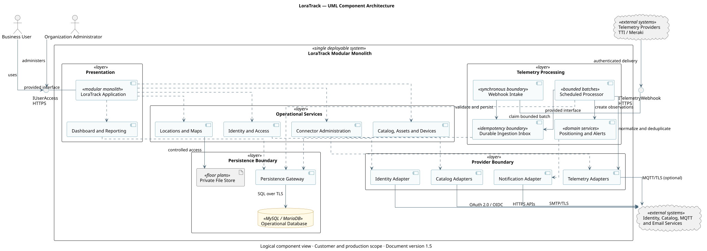

<section class="cover">
<h1>LoraTrack</h1>
<h2>Customer Technical and User Guide</h2>
<p><strong>Document version:</strong> 1.5</p>
<p><strong>Classification:</strong> Public product documentation</p>
</section>

<div class="page-break"></div>

# Document Control

| Field | Value |
| --- | --- |
| Product | LoraTrack |
| Document type | Customer Technical and User Guide |
| Document version | 1.5 |
| Audience | Users, administrators, engineering, operations, and security teams |

> This documentation describes product capabilities and procedures. References to practices or standards do not constitute certification, independent assurance, or formal customer acceptance.

# Document Index

- [Executive Product and Technical Summary](#docs-engineering-executive-technical-summary-md)
- [System Architecture](#docs-architecture-system-architecture-md)
- [LoraTrack User Guide](#docs-user-guide-md)
- [External Integrations and Contracts](#docs-engineering-integrations-md)
- [Internal and External API Contracts](#docs-engineering-api-contracts-md)
- [Security, Identity, and Tenant Isolation](#docs-engineering-security-and-identity-md)
- [Operations, Monitoring, and Runbooks](#docs-operations-operations-runbook-md)
- [Field Commissioning Guide](#docs-operations-field-commissioning-md)
- [TTI Integration](#docs-integrations-tti-md)
- [SAP S/4HANA Integration](#docs-integrations-sap-md)

<div class="page-break"></div>

<a id="docs-engineering-executive-technical-summary-md"></a>

# Executive Product and Technical Summary

## Executive Purpose

LoraTrack provides a governed inventory and location platform for physical assets in industrial indoor and outdoor environments. It combines product catalogs, asset identity, device assignments, IoT telemetry, floor plans, location estimates, alerts, and operational history in a single multi-organization application.

The platform is intended to improve asset visibility, reduce manual location searches, preserve chain-of-custody evidence, and provide a consistent operational record across catalog, telemetry, and location workflows.

## Business Outcomes

LoraTrack is designed to support the following outcomes:

- a consolidated register of products, physical assets, and tracking devices;
- reduced time spent locating assets and investigating missing equipment;
- traceable device-to-asset assignments with historical validity;
- earlier identification of offline assets, low-confidence locations, and zone events;
- reusable integration with enterprise catalogs and IoT providers;
- organization-level isolation for shared-platform operation;
- auditable operational changes and reproducible location evidence.

Realized benefits depend on device coverage, floor-plan quality, calibration, integration availability, user adoption, and agreed operating procedures.

## Product Scope

### Included

- Product and SKU catalog management and synchronization.
- Physical asset registration and time-bound device assignment.
- Device inventory for BLE beacons, scanners, gateways, LoRaWAN trackers, and Meraki access points.
- Sites, buildings, floors, zones, floor plans, and installed anchors.
- Telemetry ingestion from TTI, generic MQTT, and Cisco Meraki Location API.
- Payload normalization, deterministic deduplication, signal observations, and position estimates.
- Operational maps, asset history, alerts, health monitoring, and audit records.
- Role-based access and organization isolation.

### Excluded or Externally Managed

- LoRaWAN network-server and radio-network operation, which remain with TTI.
- Guaranteed physical accuracy without site calibration and adequate anchor geometry.
- Certified metrology, personnel safety, emergency response, or life-safety positioning.
- Customer governance controls such as service ownership, business continuity approval, and formal certification.

## Current Delivery Status

| Area | Current state | Executive interpretation |
| --- | --- | --- |
| Core inventory and assets | Implemented | Available for controlled operational use after environment validation. |
| Organization isolation and roles | Implemented and covered by automated tests | Requires customer access reviews and role ownership. |
| TTI, MQTT, and Meraki telemetry | Implemented | Requires provider configuration, credentials, monitoring, and capacity validation. |
| Catalog integrations | SAP, Business Central, Shopify, Odoo, and CSV adapters implemented | Provider permissions and supported API versions must be validated per deployment. |
| Positioning | RSSI-based estimation, calibration, confidence, and history implemented | Accuracy remains environment-dependent and must be field-validated. |
| Deployment and operations | Documented for Linux and Windows | Production readiness depends on backup, recovery, monitoring, TLS, and operational ownership. |
| Formal certification | Not claimed | Certification requires independently verified organizational and technical evidence. |

## Architecture and Operating Model

LoraTrack is delivered as a modular Laravel 12 monolith. This provides one controlled application deployment while preserving logical boundaries among catalog, assets, devices, locations, connectors, telemetry, positioning, dashboard, and identity capabilities.

The production operating model requires:

- PHP 8.2 or later and a supported MySQL, MariaDB, or SQL Server deployment baseline;
- HTTPS and protected application secrets;
- the Laravel scheduler invoked every minute;
- an MQTT listener only when MQTT connectors are enabled;
- database backup, tested restoration, monitoring, and incident procedures;
- named owners for application, infrastructure, integrations, security, and data.

Deferred telemetry and catalog processing is performed by scheduled Laravel commands. A persistent Laravel Queue worker is not required.

## Security and Governance Controls

- Business data is scoped by `organization_id` and active membership.
- Effective roles belong to organization memberships.
- Connector credentials are encrypted at rest and excluded from responses and logs.
- External events are authenticated, persisted, deduplicated, and processed idempotently.
- Floor plans and organization branding files use private storage.
- Server-side authorization protects every supported operation.
- Web mutations produce audit records and correlation identifiers.
- Connector errors are sanitized before presentation.
- Public documentation does not claim certification or independent assurance.

These application controls must be complemented by infrastructure hardening, access reviews, supplier management, incident response, backup governance, continuity planning, training, and evidence retention.

## Executive Risks and Treatments

| Risk | Business impact | Required treatment | Accountable role |
| --- | --- | --- | --- |
| Inadequate anchor coverage or calibration | Incorrect or unavailable asset positions | Conduct site survey, calibration, acceptance testing, and periodic revalidation. | Operations and engineering owner |
| Scheduler, connector, or provider interruption | Delayed telemetry and stale dashboard information | Monitor backlog and last activity; define alerting and recovery procedures. | Platform operations owner |
| Uncontrolled retention growth | Increased storage cost and degraded performance | Approve retention periods, capacity thresholds, archival, and deletion rules. | Data and service owner |
| Credential exposure or excessive access | Unauthorized data or integration access | Apply least privilege, rotation, access reviews, and protected secret storage. | Security and application owner |
| Untested backup or recovery | Extended outage or permanent data loss | Define RPO/RTO, automate backups, and test restoration on a schedule. | Infrastructure and continuity owner |
| Provider or API change | Integration failure or incomplete catalog/telemetry data | Pin supported contracts, monitor provider changes, and maintain contract tests. | Integration owner |
| Misrepresentation of positioning accuracy | Unsafe or incorrect operational decisions | Publish confidence and limitations; prohibit life-safety or certified-metrology claims. | Product and operational owner |

## Executive Metrics

Production approval should define targets and reporting ownership for at least:

- service availability and scheduled-processing success rate;
- webhook response latency and rejected-request rate;
- pending, failed, and oldest telemetry-event age;
- connector last-success time and synchronization failure rate;
- asset and device coverage, assignment completeness, and stale-device rate;
- percentage of estimates meeting the agreed confidence and accuracy threshold;
- alert delivery success and incident acknowledgment time;
- backup success, restoration-test result, achieved RPO, and achieved RTO;
- active-user adoption and completion of required operational workflows.

Numeric targets must be approved for each customer environment after baseline and field testing; this document does not invent universal SLA or accuracy commitments.

## Decisions Required Before Production Approval

Executive sponsors and service owners must approve:

1. Business scope, participating organizations, and accountable service owner.
2. Hosting model, support model, operating hours, and escalation path.
3. Target availability, response times, RPO, RTO, and retention periods.
4. Accepted positioning use cases, field accuracy criteria, and prohibited uses.
5. Integration ownership, provider credentials, API permissions, and supplier dependencies.
6. Role model, access-review frequency, and administrative segregation.
7. Monitoring, incident response, backup, restoration, and continuity evidence.
8. Pilot acceptance criteria, rollout stages, training, and change-management plan.
9. Budget and staffing for infrastructure, field commissioning, support, and lifecycle maintenance.

## Recommended Adoption Stages

1. **Technical validation:** verify deployment, security baseline, integrations, scheduler, backup, and restoration.
2. **Controlled pilot:** commission one representative site, calibrate anchors, establish baseline metrics, and obtain user feedback.
3. **Operational acceptance:** approve accuracy, monitoring, procedures, support, training, and risk treatment.
4. **Phased rollout:** expand by site or business unit with explicit acceptance checkpoints.
5. **Service operation:** review KPIs, incidents, access, capacity, provider changes, and continuity evidence periodically.

## Document Governance

| Control | Requirement |
| --- | --- |
| Document owner | LoraTrack Product Engineering |
| Business approver | Designated customer executive sponsor or service owner |
| Operational approver | Designated platform operations owner |
| Status | Public product documentation; approval evidence remains deployment-specific |
| Review cycle | At each published product-documentation change and at least annually |
| Version control | The public document version is maintained in `docs/VERSION` and incremented whenever published content changes |

## Executive Conclusion

LoraTrack provides a coherent technical foundation for governed asset inventory and location workflows. Production suitability cannot be determined from application controls alone. Approval requires deployment-specific evidence, field accuracy validation, service ownership, measurable targets, accepted residual risk, and demonstrated backup and recovery capability.

<div class="page-break"></div>

<a id="docs-architecture-system-architecture-md"></a>

# System Architecture

## Purpose

This UML component diagram presents the complete logical architecture visible to a customer planning, integrating, securing, and operating LoraTrack. It shows responsibilities and information flows without exposing source-code structure or development tooling.

LoraTrack is a modular monolith: all modules shown inside the system boundary form one deployable application. The internal boundaries separate responsibilities and provider contracts; they do not represent independently deployed microservices.



## Architectural Responsibilities

| Area | Responsibility |
| --- | --- |
| User access | Provides authenticated browser access for business users and organization administrators. |
| Identity and access | Authenticates local or Microsoft identities and enforces organization membership and role authorization. |
| Asset operations | Manages products, physical assets, tracking devices, assignments, locations, maps, and zones. |
| Integration management | Configures and supervises telemetry and catalog connectors without exposing stored credentials. |
| Telemetry intake | Validates and durably accepts provider events before deferred processing. |
| Scheduled processing | Normalizes, deduplicates, creates observations, calculates positions, evaluates alerts, synchronizes catalogs, and applies retention policies. |
| Operational reporting | Presents current state, history, maps, alerts, and connector health from normalized application data. |
| Persistence | Stores tenant-isolated operational records, private files, audit evidence, and durable ingestion buffers. |

## Integration Boundaries

- Users communicate with LoraTrack exclusively through HTTPS.
- Telemetry providers send authenticated HTTPS webhooks, or use an explicitly configured outbound MQTT connection.
- Catalog providers are accessed through authenticated HTTPS APIs.
- Microsoft Entra ID is optional and used only when Microsoft sign-in is enabled.
- SMTP is optional and supports invitations and notifications.
- External provider formats are translated at the integration boundary before entering operational records.

The editable UML source is provided in [`system-component-diagram.puml`](architecture/diagrams/system-component-diagram.puml).

## Engineering Assumptions

- The diagram is a logical component view of one modular-monolith deployment and does not prescribe separate servers or processes for each component.
- Provider payloads terminate at integration boundaries and are normalized before use by operational components.
- The durable ingestion inbox and operational repositories share the approved relational database unless a future architecture decision explicitly changes that boundary.
- Tenant authorization applies to every application service and persistence operation, even where repeated authorization dependencies are omitted for readability.

<div class="page-break"></div>

<a id="docs-user-guide-md"></a>

# LoraTrack User Guide

## Purpose and Audience

This guide describes the functional use of LoraTrack for administrators, supervisors, operators, engineering personnel, and read-only users. Available options depend on the user role and active organization.

## Access and Sessions

1. Open the HTTPS URL provided by the administrator.
2. Enter the email address and password associated with your account, or use Microsoft sign-in when enabled by the organization.
3. When credentials are invalid, the application displays a generic message and does not disclose whether the email address is registered.
4. Sign out when work is complete, particularly on shared workstations.

Access is always restricted to the active organization. Users who belong to multiple organizations must verify the selected context before viewing or modifying information.

## Primary Navigation

- **Dashboard:** operational status, recent activity, locations, and alerts.
- **Products:** commercial definitions and references received from external catalogs.
- **Assets:** trackable physical instances, status, mobility, and assigned devices.
- **Devices:** registered beacons, scanners, gateways, and trackers.
- **Locations:** sites, buildings, floors, zones, floor plans, and known installations.
- **Connectors:** telemetry and catalog integrations, subject to authorization.
- **Users and settings:** memberships, roles, visual identity, and administration.

## Products and Assets

A product is a catalog definition; an asset is an individual physical unit. A SKU must not be used as the unique identifier of an asset.

When creating or editing an asset:

1. Select the applicable product.
2. Enter a unique asset tag and a recognizable name.
3. Define its mobility behavior.
4. Assign a compatible device and tracking strategy.
5. Verify the assignment start date.

Assignments are historical records. To replace a device, close the current assignment and create a new one without altering prior records.

## Devices and Locations

Devices must be registered with their actual technical identifier. Fixed scanners and beacons require an active installation associated with a location or floor plan. Before relying on a position:

- confirm that the device is active;
- confirm that its installation belongs to the correct floor;
- verify the floor plan scale and physical dimensions;
- validate calibration, reference RSSI, and path-loss exponent where applicable.

## Floor Plans and Zones

Floor plans are stored privately. To configure a floor plan:

1. Upload the supported source file and preview.
2. Specify its physical dimensions in meters.
3. Draw zones using normalized coordinates.
4. Place fixed installations in the same coordinate system.
5. Visually verify alignment, scale, and zone membership.

Do not mix geographic coordinates with local floor coordinates.

## Connectors

Connectors are separated into telemetry and catalog integrations. The recommended administrative workflow is:

1. Create an instance and select its provider.
2. Complete server-side configuration and credentials.
3. Test the connection using a minimal read operation.
4. Review the sanitized result.
5. Activate the connector.
6. Monitor its latest activity, errors, and pending volume.

Stored credentials are never displayed again. They must be changed through an explicit rotation procedure.

## Telemetry, Positions, and History

Receiving telemetry does not guarantee that a position can be calculated. A position may remain unknown or have low confidence when anchors, coordinates, calibration data, or sufficient signal evidence are unavailable.

When investigating an asset:

1. Review the device's latest reception time.
2. Confirm the active assignment between the device and asset.
3. Review available signal observations.
4. Verify the estimation algorithm, confidence, and accuracy.
5. Use historical data to distinguish an isolated reading from a consistent trajectory.

## Alerts and Operations

Administrators and supervisors configure rules and authorized recipients. Every alert must be reviewed together with its evidence and observation time. An alert must not be interpreted as a guarantee of physical accuracy.

The operational health view reports failed or delayed telemetry, connector status, floor plans, pending scanners, and recent records. The scheduler must run every minute for deferred processing to advance.

## Security and Recommended Practices

- Do not share accounts or connector credentials.
- Use unique passwords and authorized Microsoft sign-in where available.
- Verify the active organization before changing data.
- Do not copy payloads, sensitive locations, or secrets into unauthorized tickets or channels.
- Report errors with the date, screen, correlation identifier, and reproducible steps while redacting secrets.
- Request the least-privileged role required for the assigned work.

## Support and Diagnostics

Before escalating an incident, record:

- the affected organization and user;
- date, time, and time zone;
- the affected asset, device, or connector;
- expected and observed results;
- the sanitized error message;
- visual evidence without secrets;
- operational scope and impact.

Technical procedures for diagnostics, backup, restoration, and continuity are provided in the deployment guide and operations runbook.

<div class="page-break"></div>

<a id="docs-engineering-integrations-md"></a>

# External Integrations and Contracts

## Principles

- Each external provider is translated into internal models.
- Domain logic must not depend on provider SDKs or payload field names.
- Heavy connector work runs through queues.
- Credentials are encrypted.
- User-visible errors are sanitized.
- Tests should use sanitized fixtures.

## Connector Types

### Telemetry

- TTI Webhook.
- Generic MQTT.
- Meraki Location.

### Catalog

- SAP S/4HANA.
- Microsoft Dynamics 365 Business Central.
- Shopify.
- Odoo.
- CSV.

## Connector Model

Table: `connectors`

Conceptual fields:

- organization;
- name;
- kind;
- provider;
- status;
- non-secret configuration;
- encrypted credentials;
- contract version;
- cursor or checkpoint;
- last activity;
- last success;
- sanitized last error;
- telemetry counters.

If a connector is disabled, queued telemetry is not processed. The job marks those events as `ignored`.

## TTI Webhook

TTI responsibilities:

- LoRaWAN network server;
- gateways;
- devices;
- session and frame counters;
- webhook delivery.

LoraTrack responsibilities:

- authenticate webhook;
- deduplicate events;
- store raw event;
- normalize payload;
- extract BLE observations;
- calculate position when possible.

Minimum contract:

```json
{
  "end_device_ids": {
    "device_id": "tracker-01",
    "dev_eui": "0011223344556677"
  },
  "received_at": "2026-07-10T11:24:49Z",
  "uplink_message": {
    "f_cnt": 42,
    "f_port": 1,
    "received_at": "2026-07-10T11:24:49Z",
    "decoded_payload": {
      "beacons": [
        {"mac": "AA:BB:CC:DD:EE:01", "rssi": -76}
      ]
    }
  }
}
```

`uplink_message.received_at` is preferred for identity and `observed_at` when present.

## MQTT

Command:

```bash
php artisan loratrack:mqtt-listen
```

The listener connects to the broker configured in the connector. It must be supervised by systemd, Supervisor, Task Scheduler, or an approved equivalent.

MQTT does not bypass queue processing. Messages are converted to events and follow the normal telemetry flow.

## Meraki Location

Routes:

```text
GET  /api/v1/ingest/meraki/{connector}
POST /api/v1/ingest/meraki/{connector}
```

The integration includes receiver validation, normalization, access point registration, and Meraki-to-internal floor plan mapping.

## SAP S/4HANA

The connector targets the Product Master API. Configuration includes:

- base URL;
- base path;
- authentication;
- timeout;
- cursor or incremental strategy when supported.

The adapter must not leak SAP entities such as `A_Product` outside the connector. Normalization produces internal products and SKUs.

## Business Central, Shopify, Odoo, and CSV

These connectors import products and normalize them into internal catalog records. They must respect:

- pagination;
- rate limits;
- idempotency;
- cursors/checkpoints;
- no deletion of local products because of partial provider responses.

CSV is a controlled manual import mechanism.

## Connection Testing

Connection tests must:

- use strict timeouts;
- not perform implicit imports;
- not expose credentials;
- store sanitized errors;
- log connector activity.

## Versioning

Each integration should document:

- external API version;
- review date;
- endpoints used;
- required permissions;
- pagination policy;
- limits and rate limits;
- error format;
- sanitized fixture.

## Connector Onboarding Checklist

- [ ] Correct provider and kind.
- [ ] Non-secret configuration validated.
- [ ] Credentials loaded and encrypted.
- [ ] Connection test successful.
- [ ] Connector active.
- [ ] Minute scheduler running and monitored.
- [ ] Logs do not contain secrets.
- [ ] Test fixture available.
- [ ] Rotation procedure documented.

<div class="page-break"></div>

<a id="docs-engineering-api-contracts-md"></a>

# Internal and External API Contracts

## Scope

This document summarizes relevant HTTP routes for integrations, operations, and visualization. It is not a formal OpenAPI specification, but it provides a review baseline for engineering teams.

## Conventions

- Web routes require an authenticated session unless stated otherwise.
- Ingestion routes use `/api/v1`.
- Exposed identifiers are generally ULIDs.
- Error responses follow Laravel behavior unless explicitly customized.
- Examples are sanitized.

## TTI Ingestion

```text
POST /api/v1/ingest/tti/{connector}
```

Headers:

```text
Authorization: Bearer {webhook_token}
Content-Type: application/json
Accept: application/json
```

Minimum payload:

```json
{
  "end_device_ids": {
    "device_id": "tracker-01",
    "dev_eui": "0011223344556677"
  },
  "uplink_message": {
    "f_port": 1,
    "f_cnt": 42,
    "received_at": "2026-07-10T11:24:49Z",
    "decoded_payload": {
      "beacons": [
        {"mac": "AA:BB:CC:DD:EE:01", "rssi": -76},
        {"mac": "AA:BB:CC:DD:EE:02", "rssi": -78},
        {"mac": "AA:BB:CC:DD:EE:03", "rssi": -80}
      ]
    }
  }
}
```

Accepted response:

```json
{
  "accepted": true,
  "duplicate": false,
  "event_id": "01...",
  "request_id": "..."
}
```

Status codes:

- `202`: accepted.
- `401`: invalid token.
- `404`: connector not found, inactive, or wrong provider.
- `413`: payload larger than 1 MB.
- `422`: validation failure.
- `429`: throttled.

## Meraki Ingestion

Receiver validation:

```text
GET /api/v1/ingest/meraki/{connector}
```

Reception:

```text
POST /api/v1/ingest/meraki/{connector}
```

The connector must be active and configured. Internal normalization produces `telemetry_events`, `signal_observations`, access point devices, and positions when mapping is sufficient.

Authenticated Meraki POST requests are stored in a durable, idempotent inbox and receive `200 OK` before normalization. The shared secret is removed before persistence. `schedule:run` processes pending inbox records, normalizes and deduplicates observations, creates telemetry events, records connector activity, and dispatches downstream observation processing.

Rejected Meraki POST requests are recorded separately from accepted telemetry. LoraTrack retains only the 10 most recent rejections per connector with the HTTP status, sanitized reason, declared version/type, request ID, and a keyed hash of the source IP. Shared secrets and complete request payloads are never stored in this diagnostic history. These records do not increment the failed telemetry counter because no `telemetry_event` was accepted.

The connector detail counters link to filtered accepted telemetry (`received`, `processed`, `pending`, or `failed`) or to the separate rejected-request history.

## Map Data

```text
GET /map/{floorPlan}/data
```

Authorization:

- authenticated session;
- `maps.view` permission.

Conceptual response:

```json
{
  "anchors": [
    {
      "id": "01...",
      "name": "Beacon A",
      "identifier": "AABBCCDDEE01",
      "type": "beacon",
      "x": 0.1,
      "y": 0.2
    }
  ],
  "positions": [
    {
      "asset_id": "01...",
      "name": "Pump 01",
      "x": 0.5,
      "y": 0.4,
      "x_meters": 5.0,
      "y_meters": 4.0,
      "confidence": 0.91,
      "accuracy_meters": 1.2,
      "calculated_at": "2026-07-10T11:24:50Z",
      "evidence": []
    }
  ]
}
```

## Asset Track

View:

```text
GET /assets/{asset}/track
```

Data:

```text
GET /assets/{asset}/track/data?floor_plan_id={id}&range=24h
```

Parameters:

- `floor_plan_id`: optional.
- `range`: `1h`, `24h`, `7d`, `30d`.
- `from`: optional date.
- `to`: optional date.
- `after`: optional incremental update date.

The response contains asset metadata, floor plan metadata, and historical `position_estimates`.

## Connector Administration

Admin web routes:

- `GET /connectors`
- `GET /connectors/{connector}`
- `GET /connectors/create/{provider}`
- `POST /connectors`
- `POST /connectors/{connector}/test`
- `POST /connectors/{connector}/toggle`
- `POST /connectors/{connector}/rotate-webhook-token`
- `POST /connectors/{connector}/sync`
- `POST /connectors/{connector}/csv`

Secrets must not be returned in full to the browser after storage.

## Floor Plans, Zones, and Installations

Relevant routes:

- `GET /floor-plans`
- `GET /floor-plans/{floorPlan}/file`
- `GET /floor-plans/{floorPlan}/model`
- `POST /floor-plans`
- `PUT /floor-plans/{floorPlan}`
- `POST /floor-plans/{floorPlan}/zones`
- `POST /floor-plans/{floorPlan}/installations`
- `PUT /installations/{deviceInstallation}`

Mutation permission:

```text
plans.manage
```

## Assets

Relevant routes:

- `GET /assets`
- `GET /assets/{asset}/photo`
- `POST /assets`
- `PUT /assets/{asset}`
- `POST /assets/{asset}/assignments`
- `DELETE /asset-assignments/{assignment}`
- `POST /assets/{asset}/refresh-position`

Mutation permission:

```text
assets.manage
```

## Error Observability

For investigations, correlate:

- `X-Request-ID` when present;
- `telemetry_events.id`;
- `connectors.id`;
- `jobs.uuid` when applicable;
- `observed_at`, `received_at`, and `processed_at`;
- Laravel logs.

## Future OpenAPI Requirements

- Versioned schemas per endpoint.
- Stable error code catalog.
- Pagination and filter documentation.
- Permission documentation per route.
- Sanitized examples per provider.
- Outbound webhook contracts if added.

<div class="page-break"></div>

<a id="docs-engineering-security-and-identity-md"></a>

# Security, Identity, and Tenant Isolation

## Identity Model

LoraTrack supports:

- local email/password login;
- Microsoft OAuth/OpenID Connect through Laravel Socialite;
- public organization registration;
- invitations to existing organizations.

A user account does not define effective authorization by itself. Effective authorization depends on the user's membership in the active organization.

## Roles

Roles defined in `App\Enums\UserRole`:

| Role | Capabilities |
| --- | --- |
| admin | Full access, connectors, users, and security administration. |
| engineer | Floor plans, anchors, calibration, decoders, and technical diagnostics. |
| supervisor | Assets, alerts, and operational supervision. |
| operator | Daily asset registration, assignment, and tracking. |
| viewer | Read-only access to products, assets, plans, and maps. |

Permissions are enforced by middleware and controllers. Hiding a menu item is not a security control.

## Multi-Tenancy

Isolation is based on:

- `organization_id` on business entities;
- `BelongsToOrganization` trait;
- `OrganizationContext`;
- `SetOrganizationContext` middleware;
- tenant-filtered route model binding and queries;
- tenant-aware validation where applicable.

Cross-organization access should return 404 or 403 depending on context.

## Authentication

### Local Login

Laravel provides:

- password hashing;
- sessions;
- CSRF protection;
- session regeneration at login;
- login throttling.

### Microsoft

Required environment variables:

```dotenv
MICROSOFT_CLIENT_ID=
MICROSOFT_CLIENT_SECRET=
MICROSOFT_TENANT_ID=
MICROSOFT_REDIRECT_URI=
```

The link uses stable `microsoft_id`. Accounts must not be automatically merged only by email unless a formal policy approves it.

## Secrets

Do not version:

- `.env`;
- connector credentials;
- TTI tokens;
- Microsoft secrets;
- database dumps;
- real payloads;
- customer floor plans;
- SSH keys.

Connector credentials must be encrypted with Laravel capabilities. The UI must not re-expose full secrets after saving them.

## Private Files

Floor plans are stored under `storage/app/private` and served through authenticated routes. Do not expose floor plans through a public storage symlink.

## Webhooks

Current controls:

- payload size limit;
- Bearer token for TTI;
- active connector required;
- telemetry route throttling;
- deduplication;
- asynchronous processing;
- sanitized errors.

Recommended enterprise controls:

- mandatory TLS;
- scheduled token rotation;
- provider IP allowlisting where available;
- WAF or reverse proxy rate and size limits;
- `X-Request-ID` logging;
- monitoring of retries and failures.

## Audit

Web mutations generate records in `audit_logs` with user, route, result, and request ID. Audit records must not include secrets or full sensitive payloads.

## Security Headers

`SecurityHeaders` middleware should remain enabled for web responses. Reverse proxies must be reviewed to avoid weakening or duplicating headers incorrectly.

## Data Classification

Potentially sensitive data:

- site plans and facility images;
- asset positions;
- device identifiers;
- telemetry payloads;
- users, emails, and memberships;
- connector tokens and credentials.

Treat these as sensitive operational customer information.

## Customer Infrastructure and Governance Controls

Enterprise approval commonly requires external evidence:

- server hardening;
- vulnerability management;
- backup and restore testing;
- disaster recovery plan;
- information asset inventory;
- access matrix;
- periodic access review;
- change management;
- environment segregation;
- centralized logging;
- incident response and monitoring;
- support agreements and SLA.

<div class="page-break"></div>

<a id="docs-operations-operations-runbook-md"></a>

# Operations, Monitoring, and Runbooks

## Objective

Define the minimum tasks required to operate LoraTrack in an enterprise environment and diagnose common failures.

## Required Processes

### Scheduler

Run every minute:

```bash
php artisan schedule:run
```

The scheduler is the only required background executor. It processes Meraki batches and observations, TTI/MQTT telemetry, and requested catalog synchronizations without Laravel Queue. TTI and MQTT commands process at most three pending events per execution.

Scheduled tasks:

- `loratrack:evaluate-alerts` every 10 minutes.
- `loratrack:manage-telemetry-storage` hourly.
- `loratrack:prune-meraki-history` hourly.

### MQTT Listener

When MQTT connectors are configured:

```bash
php artisan loratrack:mqtt-listen
```

The listener must be supervised and restarted on failure.

## Operational Health View

Route:

```text
/operations/health
```

Review:

- stuck telemetry;
- connector errors;
- private storage state;
- anchors by floor plan;
- recent audit records.

## Logs

Laravel log:

```text
storage/logs/laravel.log
```

Scheduler cron output example:

```bash
php artisan schedule:run >> storage/logs/schedule.log 2>&1
```

Do not enable tracing that prints credentials.

## Runbook: Telemetry Stays Pending

1. Confirm scheduler execution:

```bash
php artisan schedule:run -v
```

2. Review recent events:

```sql
select id, connector_id, device_id, processing_status, processing_error,
       observed_at, received_at, processed_at
from telemetry_events
order by received_at desc
limit 20;
```

3. Check database connection limits if `max_user_connections` appears.

4. Confirm there is only one cron entry invoking the scheduler each minute.

## Runbook: TTI Arrives but Asset Time Does Not Update

1. Check recent event identity and timestamps.
2. Check event processing status.
3. Check active asset-device assignment.
4. Check that the event has signal observations.
5. Check whether a position estimate was generated.

Useful SQL:

```sql
select id, device_id, observed_at, received_at, processing_status, processing_error
from telemetry_events
order by received_at desc
limit 10;
```

## Runbook: Track View Shows Fewer Points Than Expected

The track view shows `position_estimates`, not raw `telemetry_events`.

Review:

```sql
select id, asset_id, telemetry_event_id, floor_plan_id, calculated_at, x, y
from position_estimates
where asset_id = '{asset_id}'
order by calculated_at desc;
```

If telemetry exists without a position, check:

- fewer than three valid MAC/RSSI observations;
- anchors not installed;
- inactive anchors;
- anchors on different floor plans;
- expired assignment;
- failed event;
- floor plan filter in the UI.

## Runbook: Disabled Connector

A disabled connector does not process telemetry. Queued events are marked `ignored` when taken by the job.

To resume:

1. Activate connector.
2. Send a new payload or requeue events according to policy.
3. Confirm `last_activity_at` and `last_success_at`.

## Runbook: Database Connection Limit Exhausted

Symptom:

```text
SQLSTATE[42000] [1226] User has exceeded the max_user_connections resource
```

Actions:

- remove duplicate scheduler cron entries;
- review cron overlap;
- review persistent connections;
- increase database limits if load justifies it.

## Monthly Maintenance Checklist

- review users and roles;
- review active connectors and tokens;
- test backup restoration;
- review `telemetry_events` growth;
- review failed scheduled commands and pending ingestion records;
- validate SMTP alerts;
- review recurring log errors;
- review applicable vendor security advisories and the approved dependency assessment report;
- update change documentation.

## Escalation Data

For level 2/3 support collect:

- exact timestamp;
- organization;
- connector;
- device identifier;
- telemetry event ID;
- asset ID;
- position estimate ID when present;
- sanitized log excerpt;
- deployed release version;
- recent configuration changes.

<div class="page-break"></div>

<a id="docs-operations-field-commissioning-md"></a>

# Field Commissioning Guide

## Objective

Define a baseline procedure for installing, validating, and calibrating LoraTrack in an industrial facility.

## Suggested Roles

| Role | Responsibility |
| --- | --- |
| Project lead | Scope, work windows, and acceptance. |
| OT/IT engineering | Network, access, servers, security, and integrations. |
| RF/IoT specialist | Devices, beacons, trackers, and gateways. |
| LoraTrack administrator | Organizations, users, connectors, and configuration. |
| Customer operations | Use case validation and acceptance criteria. |

## Prerequisites

- Current floor plan.
- Real dimensions in meters.
- Asset inventory.
- Device inventory.
- TTI, MQTT, or Meraki connectivity as required.
- LoraTrack environment access.
- Approved credentials and tokens.
- Authorized installation window.
- Defined success criteria.

## Step 1: Environment

1. Confirm the deployed release version.
2. Confirm `APP_DEBUG=false`.
3. Confirm scheduler operation every minute.
4. Confirm scheduled telemetry processing.
5. Confirm SMTP if alerts are used.
6. Confirm backups.
7. Confirm basic monitoring.

## Step 2: Organization and Users

1. Create organization.
2. Create administrator.
3. Configure branding if required.
4. Invite users.
5. Assign roles by responsibility.
6. Validate access with a non-admin user.

## Step 3: Floor Plans

1. Create location.
2. Upload raster plan or preview image.
3. Register real width and height in meters.
4. Verify orientation.
5. Draw operational zones.
6. Store evidence of dimensions used.

## Step 4: Fixed Devices

1. Register beacons or scanners.
2. Install physically.
3. Register coordinates on the floor plan.
4. Confirm correct type: `beacon` or `scanner`.
5. Confirm status `active`.
6. Register initial RSSI parameters:
   - reference RSSI;
   - path loss exponent.

## Step 5: Connectors

### TTI

1. Create TTI connector.
2. Generate a long token.
3. Activate connector.
4. Configure webhook in TTI.
5. Send a test payload.
6. Confirm event is `processed`.
7. Confirm observations in `signal_observations`.

### MQTT

1. Create MQTT connector.
2. Validate host, port, TLS, and credentials.
3. Run listener.
4. Confirm message reception.

### Catalog

1. Create connector.
2. Test connection.
3. Run synchronization.
4. Validate imported products and SKUs.

## Step 6: Assets and Assignments

1. Create or import assets.
2. Register trackers or mobile beacons.
3. Assign device to asset.
4. Select strategy:
   - `fixed_beacons_mobile_tracker`;
   - `mobile_beacon_fixed_scanners`.
5. Validate start date.
6. Avoid duplicate active assignments.

## Step 7: Position Validation

1. Place asset at a known point.
2. Wait for or force an uplink.
3. Confirm `telemetry_events`.
4. Confirm at least three valid observations.
5. Confirm `position_estimates`.
6. Compare calculated position with real point.
7. Record observed error.
8. Repeat in multiple points.

## Step 8: Calibration

Use the floor plan calibration workbench:

1. Select strategy.
2. Enter real X/Y point.
3. Enter median RSSI per anchor.
4. Review RMSE and residuals.
5. Adjust reference RSSI and path loss exponent.
6. Apply only if the estimate improves.
7. Keep calibration history.

## Step 9: Acceptance Criteria

Examples:

- telemetry processed under N seconds;
- percentage of uplinks with valid position;
- median error below N meters in pilot zone;
- map updates within expected interval;
- track view shows expected history;
- SMTP alerts reach recipients;
- dashboards load within target time;
- users only see their organization.

## Step 10: Operational Handover

Deliver:

- customer-managed credentials;
- connector list;
- token rotation owners;
- device inventory;
- location and floor plan map;
- calibration parameters;
- runbooks;
- support procedure;
- accepted risks.

## Commissioning Evidence

Store:

- date and time;
- release version;
- participants;
- floor plan used;
- test points;
- position results;
- detected errors;
- corrective actions;
- counterpart approval or sign-off.

<div class="page-break"></div>

<a id="docs-integrations-tti-md"></a>

# TTI Integration

LoraTrack receives uplinks from The Things Stack through HTTPS. TTI remains responsible for the LoRaWAN network, gateways, devices, and delivery.

## Inbound Contract

- Endpoint: `POST /api/v1/ingest/tti/{connector}`
- Authentication: `Authorization: Bearer <token>`
- Accepted response: HTTP 202
- Idempotent identity: stable hash of device, session, frame counter, and TTI timestamp

LoraTrack stores `raw_payload`, receive time, and the normalized version. The job extracts `decoded_payload`, `frm_payload`, `rx_metadata`, frame counter, port, and device information.

Reference: <https://www.thethingsindustries.com/docs/integrations/webhooks/>

<div class="page-break"></div>

<a id="docs-integrations-sap-md"></a>

# SAP S/4HANA Integration

The initial connector consumes Product Master through OData (`API_PRODUCT_SRV`). The base URL and path are configurable to support different deployments.

## Normalization

| SAP | LoraTrack |
| --- | --- |
| `Product` | external reference and SKU code |
| `ProductDescription` | product/SKU name |
| `BaseUnit` | base unit |
| `ProductType` | attribute |
| `ProductGroup` | attribute |

Codes are stored as text and preserve leading zeroes. Each reference is unique by connector and SAP identifier. A checksum avoids unnecessary writes.

Product Master does not represent stock by plant or warehouse. That capability requires a separate API and synchronizer.

Reference: <https://api.sap.com/api/API_PRODUCT_SRV/overview>